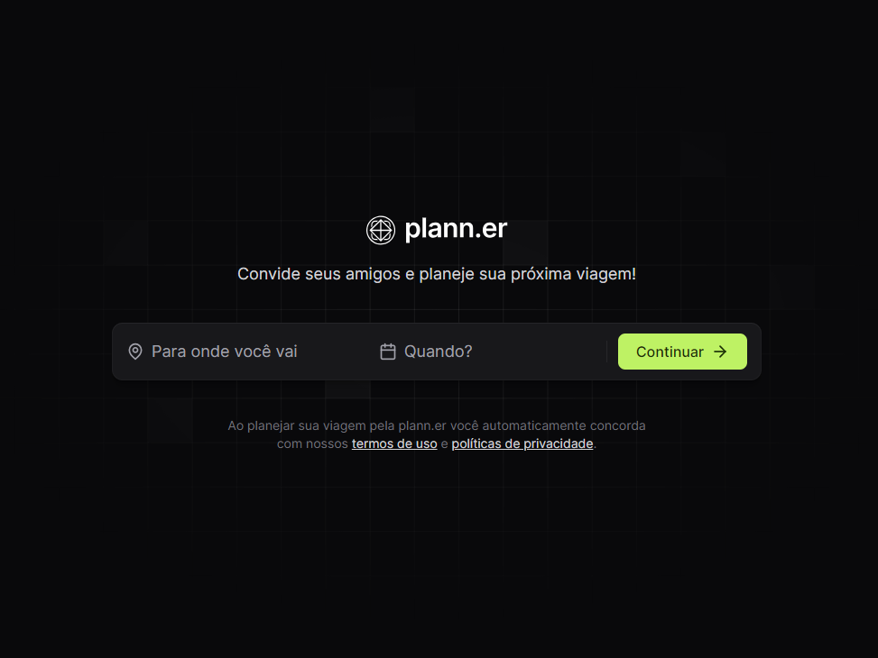

<div align="center">
  <h1>🔴 Project: Plann.er</h1>
</div>

<div align="center">
  
</div>

<div align="center">
  <p>
    This project is built with React, TailwindCSS and some other tools such as Axios, React-Router-Dom, Lucide-React, Date-FNS, Sonner, Vite, Typescript, React-Day-Picker to develop a planning and management application. combined trips between friends where there is another application built on the server side that works by storing the trip information.
  </p>
</div>

<div align="center">
  <a href="https://www.npmjs.com/package/pnpm" target="_blank">
    
  </a>
  <a href="https://www.npmjs.com/package/react" target="_blank">
    
  </a>
  <a href="https://www.npmjs.com/package/tailwindcss" target="_blank">
    
  </a>
  <a href="https://www.npmjs.com/package/axios" target="_blank">
    
  </a>
  <a href="https://choosealicense.com/" target="_blank">
    
  </a>
  <a href="https://vercel.com/" target="_blank">
    
  </a>
</div>

## 🛠️ Technologies

- HTML5, CSS3, JS ES6+
- [Node e Pnpm](https://nodejs.org/)
- [React](https://react.dev/)
- [React-day-picker](https://github.com/gpbl/react-day-picker)
- [React-router-dom](https://reactrouter.com/en/main)
- [TailwindCSS](https://tailwindcss.com/docs/installation)
- [Tailwind-variants](https://www.tailwind-variants.org/)
- [Lucide-react](https://lucide.dev/guide/packages/lucide-react)
- [Date-fns](https://date-fns.org/)
- [Sonner](https://sonner.emilkowal.ski/)
- [Axios](https://axios-http.com/ptbr/docs/intro)
- [Vite](https://vitejs.dev/)

## 📣 Funcionalities

- Collects all trip data (Destination, Start and end of trip, guests, organizer)
- Create the trip and send invitation emails
- Create activities, invite new members, add new links
- Manage activities, members and important links

## 💿 Installing

Install the project with the following command

```bash
  pnpm install
```

## 🚀 Deploy

To deploy this project, execute

```bash
  vercel
```

## 💻 Running build

To run the build, execute

```bash
  pnpm build
```

## 🧰 Used stacks

**Front-end:** React, TailwindCSS, React-Day-Picker, Axios, Date-FNS, Lucide-React, React-Router-Dom, Sonner, Tailwind-Variants, Vite

**Back-end:** Node.js, Express, Prisma, Fastify, Dayjs, Nodemailer, Zod (in another repo)

## 📸 Screenshots



## 📝 License

This project is under [MIT license](LICENSE).